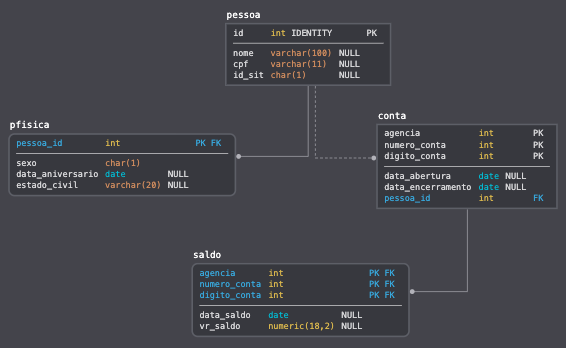

# Demo GIT - Data Tech Day 10/08/2019

 Segue o diagrama utilizado na Demo 

## Comandos GIT

### Cerifica a versão do GIT

    git --version

### Cria o repositorio git no diretorio

    git init

### Sincroniza o repositorio local com o remoto

    git remote add origin https://github.com/**user**/**repo**.git

### Adiciona no Stage

    git add * 

### Commita as mudanças no repositorio local git

    git commit -m "Comentário"

### Envia as mudanças para o repositorio remoto

    git push origin master

### Cria uma branch

    git checkout -b feature

### Adiciona no Stage

    git add * 

### Commita as mudanças no repositorio local git

    git commit -m "Alteração para incluir nova funcionalidade"

### Envia as mudanças para o repositorio remoto

    git push origin nova_funcionalidade

### Atualiza a master local com as mudanças da master Origin

    git pull origin master

Author: Sérgio Passos
Github: https://github.com/spassos

